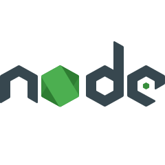

### Привет, меня зовут Артём

## Я Junior Frontend разработчик

- 💻 Начинающий веб разработчик
- ☀️ Преисполняюсь в своём познании React 
- 👯 Буду рад любому сотрудничеству и дельному совету
- 🔨 Сейчас работаю над проектом [Социальной Сети (React+Redux)][social] (<strong> Обязательно к просмотру!</strong> )

### Языки и инструменты:

 

### Смотрю в будущее

Заинтересован  в:

-[Нейросети/машинное обучение][python]

-[Django][django]

-[A progressive Node.js framework (Nest.js)][nest]

### Связаться со мной:

HeadHunter  
https://krasnoyarsk.hh.ru/resume/b8aa4595ff087f8b060039ed1f6c683241544a

 

### <strong>P.S.</strong>
Открыт к новым челленджам и интересным задачам!

[python]: https://www.python.org/
[django]: https://www.djangoproject.com/
[nest]: https://nestjs.com/
[social]: https://github.com/ArtemKhairov/social

